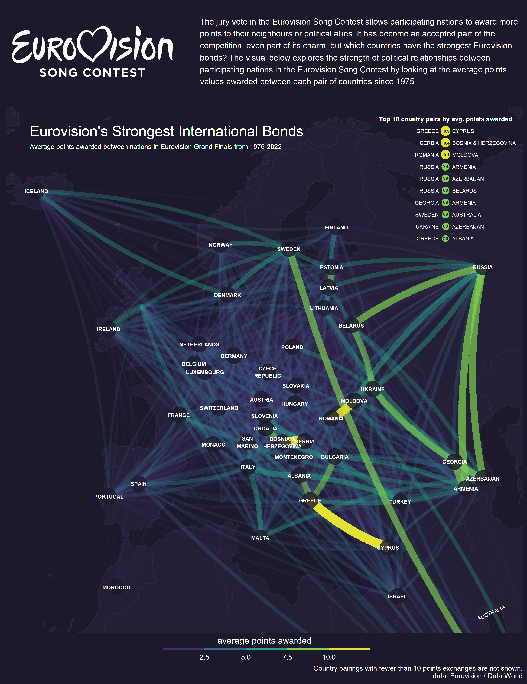

```{r setup, include=FALSE}
knitr::opts_chunk$set(echo = TRUE)
```

[TidyTuesday](https://github.com/rfordatascience/tidytuesday) is a weekly social data project in R, where new datasets are provided each week and participants are encouraged to practice their data wrangling and visualisation skills in R using Tidyverse packages (and more.)

## Highlights

### Week 20 - Eurovision

[](2022 Week 20 - Eurovision/Eurovision Map.R)

### Week 21 - Women's Rugby

[](2022 Week 21 - Womens Rugby/All Blacks Logo Chart.R)

### Week 4 - Board Games

[](2022 Week 4 - Board Games/scripts/BoardGames_CheckersChart.R)

### Week 26 - Paygap UK

[](2022 Week 26 - Paygap UK/Paygap.R)

